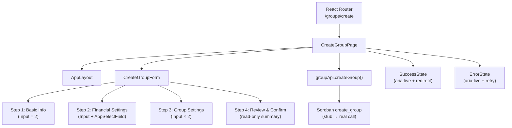

# Design Document: create-group-page

## Overview

The `create-group-page` feature adds a dedicated page to the Stellar Save frontend that lets authenticated users create a new ROSCA savings group. The page hosts a 4-step form that collects group details, validates inputs client-side, converts values to the format expected by the Soroban smart contract, and handles loading, success, and error states before redirecting the user to the newly created group.

The design follows the existing page pattern (`AppLayout` + `AppCard`), reuses the existing `CreateGroupForm` skeleton (upgraded), and wires into the existing routing system with minimal changes.

---

## Architecture



State flows upward: `CreateGroupForm` owns field values and step index; `CreateGroupPage` owns submission status (`idle | loading | success | error`) and the returned group ID.

---

## Components and Interfaces

### CreateGroupPage

Top-level page component. Owns submission state and orchestrates the API call.

```tsx
// frontend/src/pages/CreateGroupPage.tsx
type SubmitStatus = 'idle' | 'loading' | 'success' | 'error';

interface PageState {
  status: SubmitStatus;
  groupId: string | null;
  errorMessage: string | null;
}
```

Responsibilities:
- Renders `AppLayout` with title `"Create Group"` and subtitle `"Set up your savings circle"`
- Passes `onSubmit` and `onCancel` callbacks to `CreateGroupForm`
- Manages `PageState` and renders the appropriate status UI
- Triggers redirect via `useNavigation` after success

### CreateGroupForm

Multi-step form component. Owns field values, step index, and per-field validation errors.

```tsx
// frontend/src/components/CreateGroupForm.tsx

interface FormData {
  name: string;
  description: string;
  contributionAmount: string;   // XLM as string, converted to stroops on submit
  cycleDuration: string;        // one of: "604800" | "1209600" | "2592000"
  maxMembers: string;
  minMembers: string;
}

interface FormErrors {
  name?: string;
  description?: string;
  contributionAmount?: string;
  cycleDuration?: string;
  maxMembers?: string;
  minMembers?: string;
}

interface CreateGroupFormProps {
  onSubmit: (data: GroupData) => void;
  onCancel: () => void;
  isSubmitting?: boolean;       // disables all interaction during API call
}
```

### GroupData (validated payload)

```tsx
// frontend/src/utils/groupApi.ts

export interface GroupData {
  name: string;
  description: string;
  contribution_amount: number;  // stroops = XLM * 10_000_000
  cycle_duration: number;       // seconds
  max_members: number;
  min_members: number;
}
```

### groupApi

```tsx
// frontend/src/utils/groupApi.ts

export async function createGroup(data: GroupData): Promise<string> {
  // stub — returns a mock group ID
  // TODO: replace with actual Soroban contract invocation
  return Promise.resolve('mock-group-id');
}
```

### Cycle Duration Options (constant)

```tsx
export const CYCLE_DURATION_OPTIONS = [
  { value: '604800',  label: 'Weekly'    },
  { value: '1209600', label: 'Bi-Weekly' },
  { value: '2592000', label: 'Monthly'   },
] as const;
```

---

## Data Models

### FormState shape

| Field | Type | Initial value | Notes |
|---|---|---|---|
| `name` | `string` | `''` | 3–50 chars |
| `description` | `string` | `''` | 1–200 chars |
| `contributionAmount` | `string` | `''` | Positive number, XLM |
| `cycleDuration` | `string` | `''` | One of the 3 option values |
| `maxMembers` | `string` | `''` | Integer ≥ 2 |
| `minMembers` | `string` | `'2'` | Integer ≥ 2, ≤ maxMembers |

### Validation rules per step

**Step 1 — Basic Information**
- `name`: required, length 3–50; errors: `"Group name must be at least 3 characters"` / `"Group name must be 50 characters or fewer"`
- `description`: required, length 1–200; errors: `"Description is required"` / `"Description must be 200 characters or fewer"`

**Step 2 — Financial Settings**
- `contributionAmount`: required, `parseFloat > 0`; error: `"Contribution amount must be greater than 0"`
- `cycleDuration`: required, non-empty; error: `"Cycle duration is required"`

**Step 3 — Group Settings**
- `maxMembers`: required, `parseInt >= 2`; error: `"Maximum members must be at least 2"`
- `minMembers`: required, `parseInt >= 2`; error: `"Minimum members must be at least 2"`
- cross-field: `maxMembers >= minMembers`; error on `maxMembers`: `"Maximum members must be greater than or equal to minimum members"`

### XLM → Stroops conversion

```ts
const stroops = Math.round(parseFloat(formData.contributionAmount) * 10_000_000);
```

Applied in `CreateGroupForm.handleSubmit` before calling `onSubmit`.

### PageState transitions

```
idle ──[submit]──► loading ──[success]──► success ──[2s timer]──► redirect
                         └──[error]────► error ──[retry]──► loading
```

---

## Correctness Properties

*A property is a characteristic or behavior that should hold true across all valid executions of a system — essentially, a formal statement about what the system should do. Properties serve as the bridge between human-readable specifications and machine-verifiable correctness guarantees.*

### Property 1: Step navigation controls are consistent

*For any* step value in {1, 2, 3, 4}, the form must render: a "Next" button if and only if the step is in {1, 2, 3}; a "Back" button if and only if the step is in {2, 3, 4}; a "Create Group" button if and only if the step is 4; and a "Cancel" button on every step.

**Validates: Requirements 2.3, 2.4, 2.5, 2.6**

---

### Property 2: Progress indicator reflects current step

*For any* step value in {1, 2, 3, 4}, the number of "active" progress segments rendered equals the current step value.

**Validates: Requirements 2.2**

---

### Property 3: Group name length validation

*For any* string used as a group name, the validator must reject strings shorter than 3 characters with `"Group name must be at least 3 characters"` and reject strings longer than 50 characters with `"Group name must be 50 characters or fewer"`, and accept strings of length 3–50.

**Validates: Requirements 3.3, 3.4**

---

### Property 4: Description length validation

*For any* string used as a description, the validator must reject the empty string with `"Description is required"` and reject strings longer than 200 characters with `"Description must be 200 characters or fewer"`, and accept strings of length 1–200.

**Validates: Requirements 3.5, 3.6**

---

### Property 5: Validation errors are accessible

*For any* form field that has a validation error, the rendered input must have `aria-invalid="true"` and an `aria-describedby` attribute pointing to the id of the rendered error message element; and a `<label>` with a matching `htmlFor` must be present.

**Validates: Requirements 3.7, 10.1, 10.2, 10.3**

---

### Property 6: Contribution amount validation

*For any* numeric value ≤ 0 (including zero and negative numbers) entered as the contribution amount, the validator must produce the error `"Contribution amount must be greater than 0"`.

**Validates: Requirements 4.3**

---

### Property 7: Member count validation

*For any* integer value less than 2 entered as max members, the validator must produce `"Maximum members must be at least 2"`. *For any* integer value less than 2 entered as min members, the validator must produce `"Minimum members must be at least 2"`. *For any* pair (max, min) where max < min, the validator must produce `"Maximum members must be greater than or equal to minimum members"`.

**Validates: Requirements 5.3, 5.4, 5.5**

---

### Property 8: Review step displays all form data

*For any* valid `FormData` object, when the form is on step 4, the rendered summary must contain the group name, description, contribution amount (in XLM), cycle duration as a human-readable label (e.g., "Weekly"), max members, and min members.

**Validates: Requirements 6.1**

---

### Property 9: XLM to stroops conversion

*For any* positive XLM value entered as the contribution amount, the `contribution_amount` field in the submitted `GroupData` payload must equal `Math.round(xlmValue * 10_000_000)`.

**Validates: Requirements 7.2**

---

### Property 10: Redirect uses returned group ID

*For any* group ID string returned by the `API_Handler`, the router must redirect to `/groups/:groupId` using that exact ID.

**Validates: Requirements 8.3**

---

### Property 11: Form fields preserved on error

*For any* `FormData` state at the time of a failed submission, all field values must remain identical after the error is received — no field is cleared or reset.

**Validates: Requirements 9.3**

---

## Error Handling

### Client-side validation errors
- Validated per-step before advancing; errors rendered inline below each field
- Submission blocked until step 3 validation passes
- Errors cleared field-by-field as the user edits

### API / contract errors
- `createGroup` rejects with an `Error` object; `message` is extracted
- If `message` is empty or undefined, fallback: `"Failed to create group. Please try again."`
- Error displayed in an `aria-live="polite"` region above the form actions
- "Create Group" button re-enabled; form fields preserved
- User can retry without re-entering data

### Unexpected errors
- Any thrown value that is not an `Error` instance is caught and the fallback message is shown

```tsx
try {
  const groupId = await createGroup(payload);
  setPageState({ status: 'success', groupId, errorMessage: null });
} catch (err) {
  const msg = err instanceof Error && err.message
    ? err.message
    : 'Failed to create group. Please try again.';
  setPageState({ status: 'error', groupId: null, errorMessage: msg });
}
```

---

## Testing Strategy

### Unit tests (Vitest + React Testing Library)

Focus on specific examples, edge cases, and integration points:

- `CreateGroupPage` renders with correct title and subtitle
- Route `/groups/create` maps to `CreateGroupPage`
- Step 4 shows "Create Group" button, not "Next"
- Step 4 renders no editable inputs
- `onSubmit` is called with correct `GroupData` when form is submitted
- Loading state disables the submit button and shows a spinner
- Success state shows the success message and group name
- Error state shows the error message and re-enables the button
- Fallback error message shown when error is empty/undefined
- `aria-live` region present and updated on success/error
- `minMembers` pre-populated with `"2"` on step 3
- Cycle duration select renders 3 options (Weekly, Bi-Weekly, Monthly)
- Helper text shown beneath contribution amount field

### Property-based tests (fast-check)

Each property test runs a minimum of 100 iterations. Tag format: `Feature: create-group-page, Property N: <text>`.

**Property 1 — Step navigation controls**
Generate a random step in {1,2,3,4}. Render the form at that step. Assert Next/Back/Cancel/"Create Group" presence matches the spec.
`// Feature: create-group-page, Property 1: step navigation controls are consistent`

**Property 2 — Progress indicator**
Generate a random step in {1,2,3,4}. Render the form. Count active progress segments. Assert count equals step.
`// Feature: create-group-page, Property 2: progress indicator reflects current step`

**Property 3 — Group name length validation**
Generate random strings of length 0–2 (too short) and 51+ (too long) and 3–50 (valid). Assert correct error or no error.
`// Feature: create-group-page, Property 3: group name length validation`

**Property 4 — Description length validation**
Generate random strings of length 0 (empty) and 201+ (too long) and 1–200 (valid). Assert correct error or no error.
`// Feature: create-group-page, Property 4: description length validation`

**Property 5 — Validation errors are accessible**
Generate a random field name and error message. Render the form with that error. Assert `aria-invalid`, `aria-describedby`, and label linkage.
`// Feature: create-group-page, Property 5: validation errors are accessible`

**Property 6 — Contribution amount validation**
Generate random numbers ≤ 0. Assert validator returns the expected error. Generate random positive numbers. Assert no error.
`// Feature: create-group-page, Property 6: contribution amount validation`

**Property 7 — Member count validation**
Generate random pairs (max, min). Assert correct errors for each invalid combination.
`// Feature: create-group-page, Property 7: member count validation`

**Property 8 — Review step displays all form data**
Generate random valid `FormData`. Render step 4. Assert all values appear in the summary.
`// Feature: create-group-page, Property 8: review step displays all form data`

**Property 9 — XLM to stroops conversion**
Generate random positive floats as XLM values. Call the conversion. Assert result equals `Math.round(xlm * 10_000_000)`.
`// Feature: create-group-page, Property 9: XLM to stroops conversion`

**Property 10 — Redirect uses returned group ID**
Generate random group ID strings. Mock `createGroup` to resolve with that ID. Submit the form. Assert redirect path is `/groups/${groupId}`.
`// Feature: create-group-page, Property 10: redirect uses returned group ID`

**Property 11 — Form fields preserved on error**
Generate random valid `FormData`. Mock `createGroup` to reject. Submit. Assert all field values are unchanged.
`// Feature: create-group-page, Property 11: form fields preserved on error`

---

## File Structure Summary

```
frontend/src/
├── pages/
│   └── CreateGroupPage.tsx          ← NEW: page shell, submission state, redirect
├── components/
│   ├── CreateGroupForm.tsx           ← UPGRADE: full 4-step form with validation
│   └── CreateGroupForm.css           ← UPGRADE: status/review/accessibility styles
├── utils/
│   └── groupApi.ts                   ← NEW: createGroup stub + GroupData type
└── routing/
    ├── constants.ts                  ← ADD: GROUP_CREATE: "/groups/create"
    └── routes.tsx                    ← ADD: CreateGroupPage lazy route entry
```

### Routing changes

`constants.ts` — add one entry:
```ts
GROUP_CREATE: "/groups/create",
```

`routes.tsx` — add one lazy import and one route config entry:
```ts
const CreateGroupPage = lazy(() => import('../pages/CreateGroupPage'));

{
  path: ROUTES.GROUP_CREATE,
  component: CreateGroupPage,
  protected: true,
  title: 'Create Group - Stellar Save',
  description: 'Create a new savings group',
},
```

### Accessibility implementation

- Every `<Input>` already wires `htmlFor`/`id` via the `label` prop and auto-generated `inputId`
- `aria-required="true"` added to all required `<Input>` and `<AppSelectField>` elements
- `aria-invalid` and `aria-describedby` already handled by the `<Input>` component; `<AppSelectField>` wrapped in a `<FormControl>` with `FormHelperText` for errors
- An `aria-live="polite"` `<div>` in `CreateGroupPage` announces success/error state changes

### Responsive layout

`CreateGroupForm` uses `max-width: 640px; margin: 0 auto` at all breakpoints. On viewports < 768px, padding reduces and the form fills the full column width. `AppLayout` already handles the outer container responsiveness. Button and input heights are set to `min-height: 44px` via CSS to meet touch target requirements.
