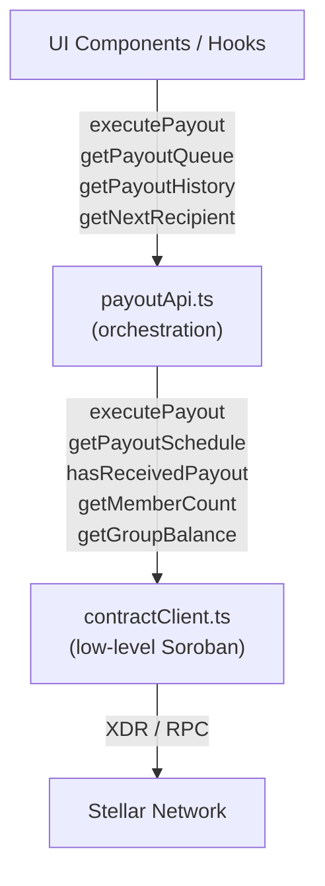

# Design Document: payout-api-methods

## Overview

`payoutApi.ts` is a thin orchestration layer that sits between UI components/hooks and the low-level `contractClient.ts`. It exposes four async functions that translate string-based group IDs and raw contract data into typed domain objects, while normalising all errors to `ContractError`.

Because the Soroban contract has no dedicated history query, both `getPayoutHistory` and `getNextRecipient` are derived by composing `getPayoutSchedule` with per-member `hasReceivedPayout` checks. Monetary values arrive as `bigint` stroops and are converted to XLM (`÷ 10_000_000`); timestamps arrive as `bigint` Unix seconds and are converted to `Date` (`× 1000`).

---

## Architecture



The module has no state of its own. Every call is a pure async transformation: fetch raw contract data → map to domain types → return or throw `ContractError`.

---

## Components and Interfaces

### Public API (`payoutApi.ts`)

```typescript
// All groupId parameters are strings at the API boundary; converted to bigint internally.

executePayout(groupId: string, callerAddress: string): Promise<string>
getPayoutQueue(groupId: string, currentUserAddress?: string): Promise<PayoutQueueData>
getPayoutHistory(groupId: string): Promise<PayoutEntry[]>
getNextRecipient(groupId: string): Promise<string | null>
```

### Dependencies (from `contractClient.ts`)

| Function | Kind | Used by |
|---|---|---|
| `executePayout({ groupId, recipient })` | write | `executePayout` |
| `getPayoutSchedule(groupId)` | read | all three read functions |
| `hasReceivedPayout(groupId, address)` | read | all three read functions |
| `getMemberCount(groupId)` | read | `getPayoutQueue` |
| `getGroupBalance(groupId)` | read | `getPayoutQueue` |
| `parseContractError(err)` | utility | all functions |
| `ContractError` | class | all functions |

### Domain Types (from `contribution.ts`)

- `PayoutEntry` — single member's queue record
- `PayoutQueueData` — full queue wrapper
- `PayoutStatus` — `'completed' | 'next' | 'upcoming'`

---

## Data Models

### PayoutScheduleEntry (contract-level, from `contractClient.ts`)

```typescript
interface PayoutScheduleEntry {
  recipient: string;   // Stellar address
  cycle: number;       // 0-based cycle index
  payout_date: bigint; // Unix timestamp in seconds
}
```

### PayoutEntry (domain-level, from `contribution.ts`)

```typescript
interface PayoutEntry {
  position: number;        // 1-based index in the queue
  memberAddress: string;
  memberName?: string;     // not populated by payoutApi (no name registry on-chain)
  estimatedDate: Date;     // derived from payout_date × 1000
  amount: number;          // XLM = groupBalance / totalMembers / 10_000_000
  status: PayoutStatus;
  txHash?: string;         // not available (no on-chain history)
  paidAt?: Date;           // getPayoutHistory only: derived from payout_date
}
```

### Conversion rules

| Contract value | Domain value |
|---|---|
| `bigint` stroops | `number` XLM = `Number(stroops) / 10_000_000` |
| `bigint` Unix seconds | `Date` = `new Date(Number(ts * 1000n))` |
| `string` groupId | `bigint` = `BigInt(groupId)` |

---

## Correctness Properties

*A property is a characteristic or behavior that should hold true across all valid executions of a system — essentially, a formal statement about what the system should do. Properties serve as the bridge between human-readable specifications and machine-verifiable correctness guarantees.*

### Property 1: ContractError pass-through

*For any* `ContractError` thrown by an underlying `contractClient` call, every `payoutApi` function shall re-throw an error with the same `code` and `message` without wrapping or modifying it.

**Validates: Requirements 1.5, 1.6, 1.7, 2.7, 3.6, 4.6, 5.1**

---

### Property 2: Non-ContractError normalisation

*For any* non-`ContractError` value thrown by an underlying call (plain `Error`, string, object, etc.), every `payoutApi` function shall catch it, pass it through `parseContractError`, and throw the resulting `ContractError`.

**Validates: Requirements 5.2**

---

### Property 3: hasReceivedPayout called for every schedule entry

*For any* payout schedule of N entries, `getPayoutQueue`, `getPayoutHistory`, and `getNextRecipient` shall each invoke `hasReceivedPayout` at least once per entry they need to inspect (queue and history inspect all N; `getNextRecipient` stops at the first unpaid entry).

**Validates: Requirements 2.2, 3.2, 4.2**

---

### Property 4: PayoutStatus assignment correctness

*For any* payout schedule with any combination of paid and unpaid entries, `getPayoutQueue` shall assign `'completed'` to every paid entry, `'next'` to exactly the first unpaid entry, and `'upcoming'` to all subsequent unpaid entries — with no other status values present.

**Validates: Requirements 2.3**

---

### Property 5: Amount conversion invariant

*For any* group balance (in stroops) and total member count, the `amount` field on each `PayoutEntry` returned by `getPayoutQueue` shall equal `Number(groupBalance) / totalMembers / 10_000_000`.

**Validates: Requirements 2.4, 6.4**

---

### Property 6: getNextRecipient returns first unpaid recipient

*For any* payout schedule with at least one unpaid entry, `getNextRecipient` shall return the `recipient` address of the earliest entry (lowest index) for which `hasReceivedPayout` returns `false`.

**Validates: Requirements 4.2, 4.3**

---

### Property 7: getPayoutHistory filters to completed entries only

*For any* payout schedule with a mix of paid and unpaid entries, `getPayoutHistory` shall return an array containing exactly the entries where `hasReceivedPayout` is `true`, each with `status: 'completed'` and `paidAt` set.

**Validates: Requirements 3.3**

---

### Property 8: Timestamp conversion round-trip

*For any* `bigint` Unix timestamp in seconds `ts`, the `Date` produced by `new Date(Number(ts * 1000n))` shall have `getTime()` equal to `Number(ts) * 1000`.

**Validates: Requirements 3.3, 6.5**

---

## Error Handling

### Guard: missing callerAddress

`executePayout` checks `callerAddress` before any async work:

```typescript
if (!callerAddress) {
  throw new ContractError(null, 'Wallet is not connected.');
}
```

### Guard: no eligible recipient

After `getNextRecipient` returns `null`:

```typescript
if (!recipient) {
  throw new ContractError(null, 'No eligible recipient found for payout.');
}
```

### Catch wrapper pattern

Every public function wraps its body in a try/catch that re-throws via `parseContractError`:

```typescript
try {
  // ...
} catch (err) {
  throw parseContractError(err);
}
```

Because `parseContractError` is idempotent for `ContractError` instances (it returns them unchanged), this pattern satisfies both Property 1 and Property 2 without double-wrapping.

### Error code reference

| Code | Meaning | Source |
|---|---|---|
| `4001` | Payout failed | contract |
| `4002` | Already processed | contract |
| `4003` | Invalid recipient | contract |
| `null` | Client-side guard | payoutApi |

---

## Testing Strategy

### Dual approach

Both unit tests and property-based tests are required. Unit tests cover specific examples and edge cases; property tests verify universal correctness across generated inputs.

**Property-based testing library**: [`fast-check`](https://github.com/dubzzz/fast-check) (already available in the JS ecosystem, works with Vitest).

### Unit tests (specific examples and edge cases)

- `executePayout` throws `ContractError("Wallet is not connected.")` when `callerAddress` is `''`
- `executePayout` throws `ContractError("No eligible recipient found for payout.")` when `getNextRecipient` returns `null`
- `getPayoutQueue` returns `{ totalMembers: 0, entries: [] }` for an empty schedule
- `getPayoutHistory` returns `[]` for an empty schedule
- `getPayoutHistory` returns `[]` when no members have been paid
- `getNextRecipient` returns `null` for an empty schedule
- `getNextRecipient` returns `null` when all members have been paid

### Property-based tests

Each test runs a minimum of **100 iterations**. Tag format: `Feature: payout-api-methods, Property {N}: {title}`.

| Test | Property | fast-check arbitraries |
|---|---|---|
| ContractError pass-through | Property 1 | `fc.record({ code: fc.option(fc.integer()), message: fc.string() })` |
| Non-ContractError normalisation | Property 2 | `fc.oneof(fc.string(), fc.object(), fc.integer())` |
| hasReceivedPayout call count | Property 3 | `fc.array(scheduleEntryArb)` |
| PayoutStatus assignment | Property 4 | `fc.array(fc.boolean())` (paid flags) |
| Amount conversion | Property 5 | `fc.bigInt({ min: 0n }), fc.integer({ min: 1 })` |
| getNextRecipient first unpaid | Property 6 | `fc.array(scheduleEntryArb), fc.array(fc.boolean())` |
| getPayoutHistory filter | Property 7 | `fc.array(scheduleEntryArb), fc.array(fc.boolean())` |
| Timestamp conversion | Property 8 | `fc.bigInt({ min: 0n, max: 9999999999n })` |

### Mocking strategy

All `contractClient` functions are mocked via `vi.mock('../lib/contractClient')`. Tests inject controlled return values and verify:
1. The correct `contractClient` functions were called with the correct arguments (bigint groupId, correct addresses).
2. The returned domain objects match the expected shape and values.
3. Errors propagate correctly.
